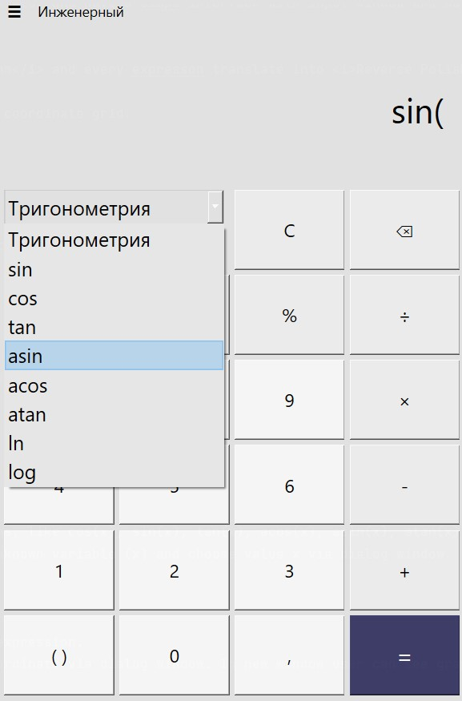
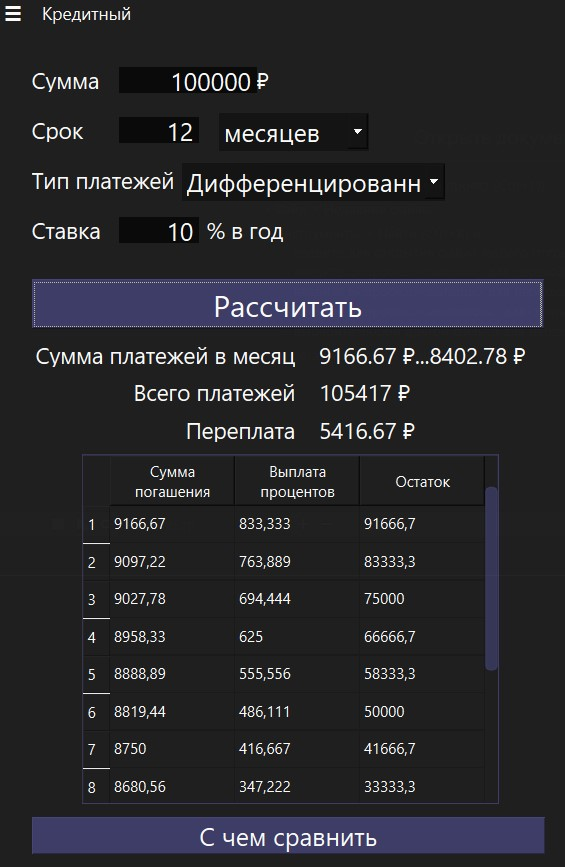
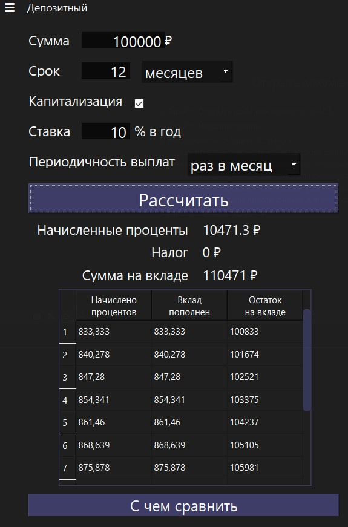
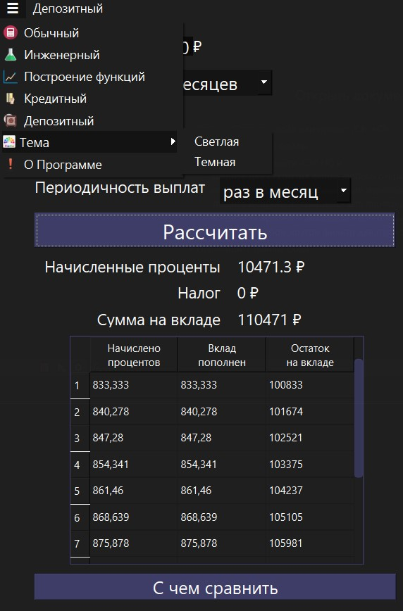
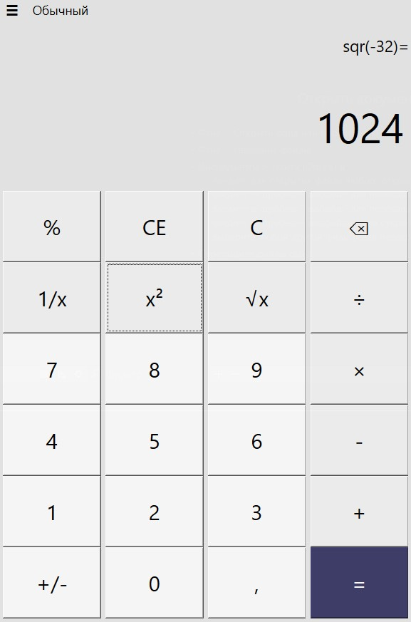
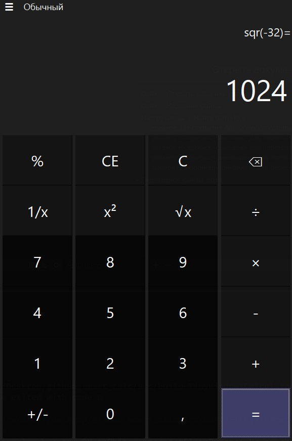

## SmartCalc_V2.0 by tonitaga

### General information

The program inplement an engineering version of calculator and have a simpe interface with input window and buttons
(digits, operations, functions, etc.).

The engine of program works by <i>Dijkstra's algorithm</i> and every expresson translate into <i>Reverse Polish
(bracketless) notation</i> and then calculate.
 Also Smart_Calc builds graphs in new window with coordinate grid.

####
### Unary signs
Smart_Calc has handling of unary characters in parentheses.

### Operations

Smart_Calc has ordinary operations with numbers, like *, /, +, -, %, ^.
User can prioritize operations

### Functions

Smart_Calc has opportunity to calculate some functions, like cos(x), sin(x), tan(x), acos(x), asin(x), atan(x), sqrt(x), ln(x), log(x).
User can get a result with any number or can input unknown variable (x) and choose value x via dialog window.

### Graph

Smart_Calc has opportunity to draw a graph of input expression.
User can press draw button and than set up center coordinate via dialog window. In new window user can see graph of a given expression.

### Credit Calculator

Smart_Calc has opportunity to calculate the credit data and show to user
monthly payment, current balance of credit. Credit can be calculated in Annuity and Differential form of credit.

### Deposit Calculator

Smart_Calc has opportunity to calculate the deposit data and show to user
monthly percent added, current balance of credit. Deposit can be calculated with capitalization or without it.

### Menu

Smart_Calc has menu to change the current type of calculator and set another color theme.

### Theme

Smart_Calc has black and Light theme.

 

#### © tonitaga (Нурислам Губайдуллин)